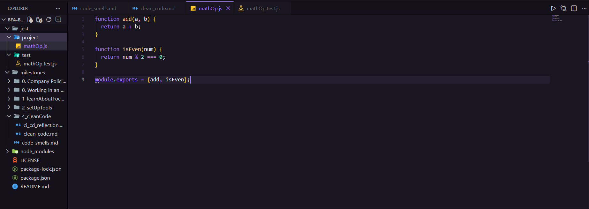
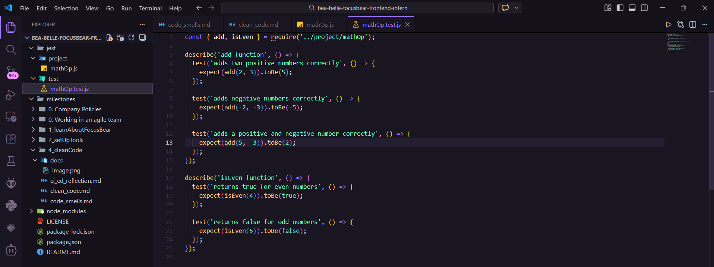
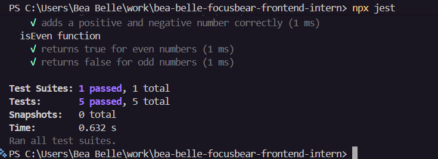

# Writing Unit Tests for Clean Code

## Research

### Importance of unit testing in software development

Unit testing is a vital process in order to ensure code quality and reliability. It involves rigorous testing that helps identify bugs and errors early on.

## Task

1. Choose a testing framework

   For this test, I utilized Jest.

2. Write a few unit tests

   I created a test file as shown in the image below or refer to mathOp.js and mathOp.test.js files:

   
   

   I tried running the test and it shows that my code works based on the tests deployed.

   

## Reflection

### How do unit tests help keep code clean

Unit tests help keep code clean by:

1. Encouraging modular design: Writing testable code naturally leads to smaller, focused functions with single responsibilities
2. Documenting behavior: Tests serve as living documentation showing how functions should be used and what they should return
3. Preventing regressions: Tests catch bugs early when refactoring or adding features, ensuring code remains clean and functional
4. Enforcing good practices: The need to write tests pushes developers to avoid code smells like tight coupling and unclear naming
5. Building confidence: With tests in place, developers can refactor and improve code quality without fear of breaking functionality

### What issues did you find while testing

While testing the mathOp functions, I encountered an issue with the file path in the require statement. Initially, I used backslashes and an absolute path (`require('jest\project\mathOp.js')`), which is incorrect in JavaScript. I learned that:

- Require statements need relative paths starting with `./` or `../`
- Forward slashes should be used instead of backslashes to avoid escape character issues
- The correct path from `jest/test/mathOp.test.js` to `jest/project/mathOp.js` is `../project/mathOp.js`

This issue helped me understand the importance of proper module paths in Node.js and Jest testing environments. 

---

# Commenting and Documentation

## Research

### Best practices for writing comments and documentation

Effective comments and documentation enhance code maintainability without cluttering the codebase. Best practices include:

1. Code should be self-explanatory about what it does; comments should explain why decisions were made
2. Keep comments updated. Outdated comments are worse than no comments; update them when code changes
3. Use clear naming over comments
4.  Always document functions that will be used by others, including parameters, return values, and examples
5. Use TODO/FIXME appropriately
6. Don't restate what the code obviously does
7. Write documentation at the right level such as: High-level overview in README files, detailed API docs in code, inline comments only when necessary

## Task

1. Find an example of poorly commented code and rewrite the comments to be more useful

Poorly commented code:

```javascript
// This function calculates
function calc(x, y, z) {
  // Add x and y
  let a = x + y;
  // Divide by z
  let b = a / z;
  // Return the result
  return b;
}

// Loop through array
for (let i = 0; i < users.length; i++) {
  // Check if active
  if (users[i].active) {
    // Do something
    processUser(users[i]);
  }
}

// Magic number for discount
const discount = 0.15;
```

Rewritten with better comments and improved code:

```javascript
/**
 * Calculates the average of two numbers.
 * Used for computing mean temperature readings from two sensors.
 * 
 * @param {number} value1 - First temperature reading in Celsius
 * @param {number} value2 - Second temperature reading in Celsius
 * @param {number} count - Number of readings (typically 2)
 * @returns {number} Average temperature in Celsius
 */
function calculateAverage(value1, value2, count) {
  const sum = value1 + value2;
  const average = sum / count;
  return average;
}

// Process only active users eligible for the monthly newsletter
for (let i = 0; i < users.length; i++) {
  if (users[i].active) {
    processUser(users[i]);
  }
}

// 15% loyalty discount for customers with 1+ year membership
const LOYALTY_DISCOUNT_RATE = 0.15;
```

## Reflection

### When should you add comments

Comments should be added when:

1. Explaining complex algorithms.
2. Documenting business rules.
3. Warning about things such as non-obvious side effects, edge cases, or potential pitfalls
4. Explaining why a particular approach was chosen over alternatives for specific reasons
5. Legal or licensing requirements.
6. there are Public API documentation.
7. When temporary solutions exist that need future attention
8. When code behavior depends on external systems, APIs, or configurations

### When should you avoid comments and instead improve the code

Avoid comments and refactor the code when and if there are:

1. Obvious statements
2. Commented-out code
3. Outdated information
4. Complex expressions
5. Long functions
6. Magic numbers
7. Unclear logic

---

# Handling Errors and Edge Cases

## Research

### Strategies for handling errors and edge cases in code (including Guard Clauses)

Proper error handling and edge case management are essential for building reliable software. Key strategies include:

1. Guard Clauses (Early Returns)
   - Validate inputs at the beginning of functions
   - Return early or throw errors for invalid conditions
   - Reduces nesting and improves readability
   - Example: Check for null/undefined before processing

2. Input Validation
   - Validate all function parameters before use
   - Check data types, ranges, and formats
   - Fail fast with clear error messages
   - Use type checking in dynamically typed languages

3. Try-Catch Blocks
   - Wrap risky operations that might throw errors
   - Catch specific error types when possible
   - Provide meaningful error messages
   - Clean up resources in finally blocks

4. Default Values and Fallbacks
   - Provide sensible defaults for optional parameters
   - Use nullish coalescing or logical OR operators
   - Ensure the application continues functioning when possible

5. Error Objects and Custom Exceptions
   - Create descriptive error messages
   - Include context about what went wrong
   - Use custom error classes for different error types

6. Boundary Checking
   - Check array bounds before accessing elements
   - Validate numeric ranges (min/max values)
   - Handle empty collections gracefully

7. Null/Undefined Handling
   - Use optional chaining (?.) for safe property access
   - Check for null/undefined before operations
   - Consider using null object pattern

8. Graceful Degradation
   - Provide alternative functionality when features fail
   - Log errors for debugging while maintaining user experience
   - Return partial results when complete results aren't available

## Task

1. Find an existing function that does not properly handle errors or invalid inputs

Original function with poor error handling:

```javascript
function calculateDiscount(price, discountPercent, customerType) {
  let discount = price * (discountPercent / 100);
  
  if (customerType === "premium") {
    discount = discount * 1.5;
  }
  
  return price - discount;
}

function getUser(userId) {
  const user = database.find(userId);
  return user.email.toLowerCase();
}

function divideNumbers(a, b) {
  return a / b;
}

function processArray(items) {
  let total = 0;
  for (let i = 0; i <= items.length; i++) {
    total += items[i].value;
  }
  return total;
}
```

2. Refactor the function to improve error handling

Refactored with proper error handling:

```javascript
function calculateDiscount(price, discountPercent, customerType) {
  // Guard clauses for input validation
  if (typeof price !== 'number' || price < 0) {
    throw new Error('Price must be a non-negative number');
  }
  
  if (typeof discountPercent !== 'number' || discountPercent < 0 || discountPercent > 100) {
    throw new Error('Discount percent must be between 0 and 100');
  }
  
  if (!customerType) {
    throw new Error('Customer type is required');
  }
  
  let discount = price * (discountPercent / 100);
  
  // Validate customer type
  const validCustomerTypes = ['regular', 'premium', 'vip'];
  if (!validCustomerTypes.includes(customerType)) {
    throw new Error(`Invalid customer type. Must be one of: ${validCustomerTypes.join(', ')}`);
  }
  
  if (customerType === "premium") {
    discount = discount * 1.5;
  }
  
  const finalPrice = price - discount;
  return Math.max(0, finalPrice); // Ensure non-negative result
}

function getUser(userId) {
  // Guard clause for null/undefined userId
  if (!userId) {
    throw new Error('User ID is required');
  }
  
  const user = database.find(userId);
  
  // Guard clause for user not found
  if (!user) {
    throw new Error(`User with ID ${userId} not found`);
  }
  
  // Guard clause for missing email
  if (!user.email) {
    throw new Error('User email is missing');
  }
  
  return user.email.toLowerCase();
}

function divideNumbers(a, b) {
  // Guard clauses for input validation
  if (typeof a !== 'number' || typeof b !== 'number') {
    throw new Error('Both arguments must be numbers');
  }
  
  if (!isFinite(a) || !isFinite(b)) {
    throw new Error('Arguments must be finite numbers');
  }
  
  // Guard clause for division by zero
  if (b === 0) {
    throw new Error('Cannot divide by zero');
  }
  
  return a / b;
}

function processArray(items) {
  // Guard clause for null/undefined array
  if (!items) {
    throw new Error('Items array is required');
  }
  
  // Guard clause for non-array input
  if (!Array.isArray(items)) {
    throw new Error('Items must be an array');
  }
  
  // Handle empty array
  if (items.length === 0) {
    return 0;
  }
  
  let total = 0;
  
  // Fixed: use < instead of <= to avoid out-of-bounds access
  for (let i = 0; i < items.length; i++) {
    // Guard clause for missing items
    if (!items[i]) {
      console.warn(`Skipping null/undefined item at index ${i}`);
      continue;
    }
    
    // Guard clause for missing value property
    if (typeof items[i].value !== 'number') {
      console.warn(`Skipping item at index ${i}: value is not a number`);
      continue;
    }
    
    total += items[i].value;
  }
  
  return total;
}
```

## Reflection

### What was the issue of the original code

The original code had multiple critical issues:

1. No input validation: Functions accepted any input without checking types, ranges, or validity
2. Unsafe property access: Accessed properties (user.email) without checking if the object exists
3. Division by zero: divideNumbers didn't prevent division by zero errors
4. Array boundary error: Loop used <= instead of <, causing out-of-bounds access
5. No null checks: Didn't handle null or undefined values
6. Missing error messages: When failures occurred, there was no context about what went wrong
7. Silent failures: Some issues would cause runtime crashes instead of providing helpful feedback
8. Invalid customer types: calculateDiscount accepted any string without validation

These issues would lead to cryptic error messages, application crashes, and difficult debugging.

### How does handling errors improve reliability

Proper error handling improves reliability in several ways:

1. Fail Fast Principle: Errors are caught immediately at the source, making them easier to diagnose and fix
2. Predictable Behavior: Functions consistently handle edge cases rather than producing undefined behavior
3. Better User Experience: Clear error messages help users understand what went wrong and how to fix it
4. Easier Debugging: Descriptive errors pinpoint exactly where and why failures occur
5. Prevents Cascading Failures: Early validation stops bad data from propagating through the system
6. Data Integrity: Validation ensures only valid data is processed, maintaining system consistency
7. Security: Input validation prevents malicious data from exploiting vulnerabilities
8. Maintainability: Clear error handling makes code intentions explicit and easier to understand

By anticipating and handling errors proactively, we create more resilient applications that users can depend on.

---

# Refactoring Code for Simplicity

## Research

### Common Refactoring techniques

Refactoring improves code structure without changing its external behavior. Common techniques include:

1. Extract Method/Function
   - Break long functions into smaller, focused ones
   - Each function should do one thing well
   - Improves readability and reusability

2. Extract Variable
   - Replace complex expressions with descriptive variable names
   - Makes code self-documenting
   - Reduces duplication of calculations

3. Rename for Clarity
   - Use descriptive names that reveal intent
   - Avoid abbreviations and single-letter variables
   - Make names searchable and pronounceable

4. Simplify Conditionals
   - Use guard clauses instead of nested if-else
   - Replace complex conditions with well-named boolean variables
   - Consider polymorphism or strategy pattern for multiple conditions

5. Remove Duplication (DRY)
   - Consolidate repeated code into shared functions
   - Use loops, higher-order functions, or abstractions
   - Maintain single source of truth

6. Replace Magic Numbers with Constants
   - Define named constants for literal values
   - Makes code more maintainable
   - Documents the meaning of values

7. Simplify Data Structures
   - Use appropriate data structures for the task
   - Flatten nested structures when possible
   - Consider using objects/maps instead of parallel arrays

8. Use Built-in Methods and Libraries
   - Replace manual loops with array methods (map, filter, reduce)
   - Leverage standard library functions
   - Reduces code and potential bugs

9. Inline Unnecessary Code
   - Remove intermediate variables that don't add clarity
   - Eliminate functions that are only called once and don't simplify

10. Replace Nested Conditionals with Early Returns
    - Reduce indentation levels
    - Make the main logic flow clearer
    - Handle error cases first

## Task

1. Find an example of overly complicated code

Overly complicated code:

```javascript
function processUserData(users) {
  let result = [];
  for (let i = 0; i < users.length; i++) {
    if (users[i] !== null && users[i] !== undefined) {
      if (users[i].age !== null && users[i].age !== undefined) {
        if (users[i].age >= 18) {
          if (users[i].country !== null && users[i].country !== undefined) {
            if (users[i].country === 'USA' || users[i].country === 'Canada' || users[i].country === 'UK') {
              let name = '';
              if (users[i].firstName !== null && users[i].firstName !== undefined) {
                name = name + users[i].firstName;
              }
              if (users[i].lastName !== null && users[i].lastName !== undefined) {
                if (name.length > 0) {
                  name = name + ' ';
                }
                name = name + users[i].lastName;
              }
              let obj = {};
              obj.fullName = name;
              obj.age = users[i].age;
              obj.country = users[i].country;
              if (users[i].email !== null && users[i].email !== undefined) {
                obj.email = users[i].email.toLowerCase();
              }
              result.push(obj);
            }
          }
        }
      }
    }
  }
  return result;
}

function calculateOrderTotal(items, tax, discount, shippingCost, promoCode) {
  let total = 0;
  for (let i = 0; i < items.length; i++) {
    total = total + (items[i].price * items[i].quantity);
  }
  let subtotal = total;
  if (discount !== null && discount !== undefined && discount > 0) {
    total = total - (total * discount);
  }
  if (tax !== null && tax !== undefined && tax > 0) {
    total = total + (total * tax);
  }
  if (promoCode !== null && promoCode !== undefined) {
    if (promoCode === 'SAVE10') {
      total = total - (total * 0.1);
    } else if (promoCode === 'SAVE20') {
      total = total - (total * 0.2);
    } else if (promoCode === 'FREESHIP') {
      shippingCost = 0;
    }
  }
  if (shippingCost !== null && shippingCost !== undefined && shippingCost > 0) {
    total = total + shippingCost;
  }
  return total;
}
```

2. Refactor it to make it simpler and more readable

Refactored code:

```javascript
function processUserData(users) {
  const ELIGIBLE_COUNTRIES = ['USA', 'Canada', 'UK'];
  const MIN_AGE = 18;
  
  return users
    .filter(isValidUser)
    .filter(user => user.age >= MIN_AGE)
    .filter(user => ELIGIBLE_COUNTRIES.includes(user.country))
    .map(transformUser);
}

function isValidUser(user) {
  return user && user.age != null && user.country;
}

function transformUser(user) {
  return {
    fullName: buildFullName(user),
    age: user.age,
    country: user.country,
    email: user.email?.toLowerCase() || ''
  };
}

function buildFullName(user) {
  const parts = [user.firstName, user.lastName].filter(Boolean);
  return parts.join(' ');
}

function calculateOrderTotal(items, tax = 0, discount = 0, shippingCost = 0, promoCode = null) {
  const subtotal = calculateSubtotal(items);
  const discountedTotal = applyDiscount(subtotal, discount);
  const promoTotal = applyPromoCode(discountedTotal, promoCode, shippingCost);
  const taxedTotal = applyTax(promoTotal.total, tax);
  const finalTotal = taxedTotal + promoTotal.shipping;
  
  return finalTotal;
}

function calculateSubtotal(items) {
  return items.reduce((sum, item) => sum + (item.price * item.quantity), 0);
}

function applyDiscount(amount, discount) {
  if (discount <= 0) return amount;
  return amount * (1 - discount);
}

function applyPromoCode(amount, promoCode, shippingCost) {
  const promoCodes = {
    'SAVE10': { discount: 0.1, freeShipping: false },
    'SAVE20': { discount: 0.2, freeShipping: false },
    'FREESHIP': { discount: 0, freeShipping: true }
  };
  
  const promo = promoCodes[promoCode];
  
  if (!promo) {
    return { total: amount, shipping: shippingCost };
  }
  
  return {
    total: amount * (1 - promo.discount),
    shipping: promo.freeShipping ? 0 : shippingCost
  };
}

function applyTax(amount, tax) {
  if (tax <= 0) return amount;
  return amount * (1 + tax);
}
```

## Reflection

### What made the original code complex

The original code was complex due to several factors:

1. Deep nesting: Multiple levels of if statements made the logic hard to follow and increased cognitive load
2. Imperative style: Manual loops and string concatenation instead of using declarative array methods
3. Verbose null checks: Repeated `!== null && !== undefined` checks cluttered the code
4. No separation of concerns: All logic was mixed together in single functions
5. Magic strings and numbers: Hardcoded values like 'SAVE10' and 0.1 without explanation
6. Poor naming: Variables like `obj`, `i`, and `result` didn't convey meaning
7. Manual accumulation: Building objects and strings piece by piece instead of using cleaner patterns
8. Mixed levels of abstraction: Low-level details mixed with high-level business logic
9. Long functions: Functions tried to do too many things at once
10. No default parameters: Had to check for null/undefined for every optional parameter
11. Conditional chains: Long if-else chains for promo codes instead of using data structures
12. Side effects on parameters: Modified shippingCost parameter value

### How did refactoring improve it

Refactoring improved the code significantly:

1. Readability: Code now reads like a series of clear steps rather than nested logic
2. Testability: Smaller functions are easier to test in isolation
3. Maintainability: Changes to business logic (like adding new promo codes) require minimal code changes
4. Reusability: Extracted functions can be used in other contexts
5. Self-documenting: Function and variable names explain what the code does
6. Reduced complexity: Each function has a single, clear purpose
7. Better error handling: Easier to add validation and error messages to focused functions
8. Modern JavaScript: Used optional chaining, default parameters, and array methods
9. DRY principle: Eliminated repeated null checks and calculations
10. Data-driven: Promo codes stored in a data structure instead of hard-coded in conditionals
11. Immutability: Functions return new values instead of mutating parameters
12. Declarative style: Array methods (filter, map, reduce) express intent clearly

The refactored code is shorter, clearer, and more maintainable while doing exactly the same thing as the original.

---

# Avoiding Code Duplication

## Research

### "Don't Repeat Yourself" (DRY) principle

The DRY principle is a fundamental software development concept that states: "Every piece of knowledge must have a single, unambiguous, authoritative representation within a system."

Key aspects of the DRY principle:

1. Single Source of Truth
   - Each piece of logic should exist in exactly one place
   - Changes only need to be made once
   - Reduces the risk of inconsistencies

2. Code Reusability
   - Extract common functionality into reusable functions or modules
   - Promotes composition over duplication
   - Enables building complex systems from simple, tested components

3. Maintainability Benefits
   - Bug fixes only need to be applied once
   - Updates propagate automatically to all usage points
   - Reduces technical debt over time

4. Readability Improvements
   - Well-named reusable functions serve as documentation
   - Less code means less to read and understand
   - Focuses attention on unique business logic

5. When to Apply DRY
   - Identical or very similar code appears multiple times
   - The same business rule is implemented in different places
   - Data transformations are repeated
   - Validation logic is duplicated

6. When not to Force DRY
   - Code looks similar but serves different purposes
   - Coupling components would reduce flexibility
   - Abstraction would be more complex than duplication
   - Different code paths may diverge in the future

7. Common Patterns for DRY
   - Extract functions for repeated logic
   - Use loops and array methods instead of repetitive statements
   - Create utility modules for cross-cutting concerns
   - Use configuration objects instead of hardcoded values
   - Leverage inheritance or composition for shared behavior

## Task

1. Find a section of code in your test repo with unnecessary repetition

Code with duplication:

```javascript
// Validation functions with repeated patterns
function validateUsername(username) {
  if (!username) {
    return { valid: false, error: 'Username is required' };
  }
  if (typeof username !== 'string') {
    return { valid: false, error: 'Username must be a string' };
  }
  if (username.length < 3) {
    return { valid: false, error: 'Username must be at least 3 characters' };
  }
  if (username.length > 20) {
    return { valid: false, error: 'Username must be at most 20 characters' };
  }
  return { valid: true };
}

function validateEmail(email) {
  if (!email) {
    return { valid: false, error: 'Email is required' };
  }
  if (typeof email !== 'string') {
    return { valid: false, error: 'Email must be a string' };
  }
  const emailRegex = /^[^\s@]+@[^\s@]+\.[^\s@]+$/;
  if (!emailRegex.test(email)) {
    return { valid: false, error: 'Email must be valid' };
  }
  return { valid: true };
}

function validatePassword(password) {
  if (!password) {
    return { valid: false, error: 'Password is required' };
  }
  if (typeof password !== 'string') {
    return { valid: false, error: 'Password must be a string' };
  }
  if (password.length < 8) {
    return { valid: false, error: 'Password must be at least 8 characters' };
  }
  if (password.length > 50) {
    return { valid: false, error: 'Password must be at most 50 characters' };
  }
  return { valid: true };
}

// API calls with repeated fetch logic
function getUser(id) {
  return fetch(`https://api.example.com/users/${id}`, {
    method: 'GET',
    headers: {
      'Content-Type': 'application/json',
      'Authorization': `Bearer ${getToken()}`
    }
  })
  .then(response => {
    if (!response.ok) {
      throw new Error('Failed to fetch user');
    }
    return response.json();
  });
}

function getProduct(id) {
  return fetch(`https://api.example.com/products/${id}`, {
    method: 'GET',
    headers: {
      'Content-Type': 'application/json',
      'Authorization': `Bearer ${getToken()}`
    }
  })
  .then(response => {
    if (!response.ok) {
      throw new Error('Failed to fetch product');
    }
    return response.json();
  });
}

function getOrder(id) {
  return fetch(`https://api.example.com/orders/${id}`, {
    method: 'GET',
    headers: {
      'Content-Type': 'application/json',
      'Authorization': `Bearer ${getToken()}`
    }
  })
  .then(response => {
    if (!response.ok) {
      throw new Error('Failed to fetch order');
    }
    return response.json();
  });
}
```

2. Refactor the code to eliminate duplication

Refactored code:

```javascript
// Generic validation helper
function createValidator(fieldName, rules) {
  return function(value) {
    // Required check
    if (rules.required && !value) {
      return { valid: false, error: `${fieldName} is required` };
    }
    
    // Type check
    if (rules.type && typeof value !== rules.type) {
      return { valid: false, error: `${fieldName} must be a ${rules.type}` };
    }
    
    // Min length check
    if (rules.minLength && value.length < rules.minLength) {
      return { valid: false, error: `${fieldName} must be at least ${rules.minLength} characters` };
    }
    
    // Max length check
    if (rules.maxLength && value.length > rules.maxLength) {
      return { valid: false, error: `${fieldName} must be at most ${rules.maxLength} characters` };
    }
    
    // Pattern check
    if (rules.pattern && !rules.pattern.test(value)) {
      return { valid: false, error: `${fieldName} must be valid` };
    }
    
    return { valid: true };
  };
}

// Create specific validators using the helper
const validateUsername = createValidator('Username', {
  required: true,
  type: 'string',
  minLength: 3,
  maxLength: 20
});

const validateEmail = createValidator('Email', {
  required: true,
  type: 'string',
  pattern: /^[^\s@]+@[^\s@]+\.[^\s@]+$/
});

const validatePassword = createValidator('Password', {
  required: true,
  type: 'string',
  minLength: 8,
  maxLength: 50
});

// Generic API helper
function apiRequest(endpoint, options = {}) {
  const defaultHeaders = {
    'Content-Type': 'application/json',
    'Authorization': `Bearer ${getToken()}`
  };
  
  const config = {
    method: options.method || 'GET',
    headers: { ...defaultHeaders, ...options.headers },
    ...options
  };
  
  return fetch(`https://api.example.com${endpoint}`, config)
    .then(response => {
      if (!response.ok) {
        throw new Error(`API request failed: ${response.statusText}`);
      }
      return response.json();
    });
}

// Simplified specific API calls
function getUser(id) {
  return apiRequest(`/users/${id}`);
}

function getProduct(id) {
  return apiRequest(`/products/${id}`);
}

function getOrder(id) {
  return apiRequest(`/orders/${id}`);
}

// Can easily extend for other HTTP methods
function createUser(userData) {
  return apiRequest('/users', {
    method: 'POST',
    body: JSON.stringify(userData)
  });
}
```

## Reflection

### What were the issues with the duplicated code

The duplicated code had several significant issues:

1. Maintenance Burden: Any change to validation logic required updating multiple functions, increasing the chance of mistakes or inconsistencies.

2. Bug Multiplication: A bug in the repeated validation pattern would exist in all copies, requiring multiple fixes.

3. Inconsistency Risk: Over time, the duplicated functions could diverge as developers update some but not others.

4. Code Bloat: Hundreds of lines of repetitive code made the codebase larger and harder to navigate.

5. Testing Overhead: Each duplicated function needed its own tests, multiplying testing effort.

6. Difficult Updates: Adding a new validation rule or changing API configuration required touching many files.

7. Cognitive Load: Developers had to read through similar code repeatedly to understand slight differences.

8. Violation of DRY: The same business rules and patterns were encoded multiple times.

9. Error-Prone: Copy-pasting code increases the risk of forgetting to update all parameters correctly.

10. Lack of Flexibility: Adding new validators or API endpoints required significant boilerplate.

### How did refactoring improve maintainability

Refactoring to eliminate duplication dramatically improved maintainability:

1. Single Source of Truth: Core logic now exists in one place, making it the authoritative implementation.

2. Easier Updates: Adding new validation rules or API features only requires changing the helper functions.

3. Consistent Behavior: All validators and API calls now share the same underlying logic, ensuring consistency.

4. Reduced Code Size: Eliminated hundreds of lines of repetitive code, making the codebase more manageable.

5. Better Testability: Testing the generic helpers thoroughly ensures all specific implementations work correctly.

6. Clear Intent: The configuration-based approach makes it obvious what rules apply to each field.

7. Reusability: The helper functions can be used for future validators and API endpoints with minimal code.

8. Centralized Bug Fixes: Fixing a bug once in the helper automatically fixes it everywhere it's used.

9. Scalability: Adding new validations or API endpoints is now trivial and requires minimal code.

10. Declarative Style: Validators are now defined by their rules rather than imperative logic.

11. Documentation: The rules object serves as clear documentation of validation requirements.

12. Flexibility: Easy to extend with new validation types without duplicating logic.

---

# Naming Variables and Functions

## Research

### Best practices for naming variables and functions

1. Be descriptive: Use names that clearly explain purpose (calculateTotal instead of calc)
2. Use pronounceable names: Avoid abbreviations like genymdhms
3. Make names searchable: Avoid single letters except in short loops
4. Follow conventions: camelCase for functions/variables, PascalCase for classes, UPPER_SNAKE_CASE for constants
5. Use verbs for functions: getName(), calculateArea(), isValid()
6. Use nouns for variables: userName, totalPrice, productList
7. Reveal intent: filteredActiveUsers instead of list2
8. Avoid mental mapping: elapsedTimeInDays instead of d
9. Add meaningful context: userEmail in a broader scope, just email within a User class

## Task

1. Find examples of unclear variable names in an existing codebase (or write your own)

Code with unclear variable names:

```javascript
// Poor naming - unclear mathematical operations
function calc(x, y) {
  let r = x * y;
  return r;
}

function proc(a, b, c) {
  let t = a + b;
  let v = t / c;
  return v;
}

let n1 = 10;
let n2 = 5;
let res = calc(n1, n2);

let p = 100;
let d = 0.2;
let fp = p - (p * d);

function compute(arr) {
  let s = 0;
  for (let i = 0; i < arr.length; i++) {
    s = s + arr[i];
  }
  let a = s / arr.length;
  return a;
}
```

2. Refactor the code by renaming variables/functions for better clarity

Refactored code with clear naming:

```javascript
// Clear naming - understandable mathematical operations
function calculateArea(width, height) {
  const area = width * height;
  return area;
}

function calculateAverage(valueOne, valueTwo, divisor) {
  const sum = valueOne + valueTwo;
  const average = sum / divisor;
  return average;
}

const rectangleWidth = 10;
const rectangleHeight = 5;
const rectangleArea = calculateArea(rectangleWidth, rectangleHeight);

const originalPrice = 100;
const discountRate = 0.2;
const finalPrice = originalPrice - (originalPrice * discountRate);

function calculateMean(numbers) {
  let sum = 0;
  for (let i = 0; i < numbers.length; i++) {
    sum = sum + numbers[i];
  }
  const mean = sum / numbers.length;
  return mean;
}
```

## Reflection

### What makes a good variable or function name?

The following practices are what makes a variable or function name good:

1. Use of simple but direct terms.
2. Consistent naming conventions
3. Reusable

### What issues can arise from poorly named variables?

Issues like unclear documentation, confusion, and less likely to be maintained are most likely to arise from poorly named variables. 

### How did refactoring improve code readability?

It made developers or your team understand your code easier and with clarity. 